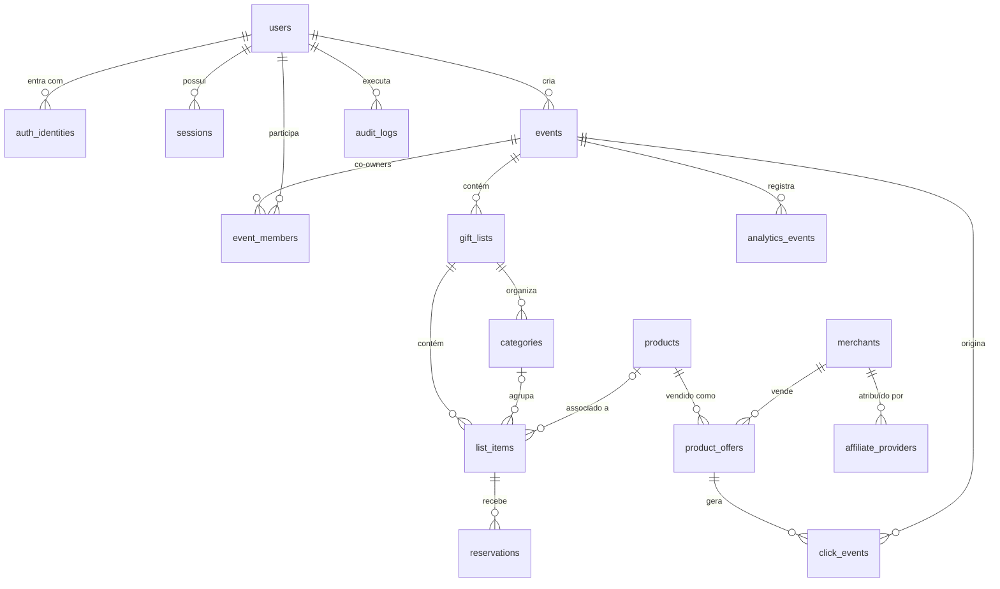

# Banco de dados

PostgreSQL 16. Migrations em `apps/api/migrations` (goose, embutidas no binário).
`make migrate`, `make migrate-down`, `make seed`, `make db-reset`.

Convenções: PK `UUID` (UUIDv7 gerado na aplicação, ordenável por tempo) · `created_at` em todas as
tabelas · `updated_at` onde há mutação · dinheiro em centavos `BIGINT` + `currency CHAR(3)` ·
enums como `TEXT` + `CHECK` (fáceis de evoluir) · soft delete apenas em `events`.

## ERD

## Tabelas e decisões

| Tabela                             | Notas                                                                                                                                                                                      |
| ---------------------------------- | ------------------------------------------------------------------------------------------------------------------------------------------------------------------------------------------ |
| `users`                            | email minúsculo, único. `role` USER/ADMIN.                                                                                                                                                 |
| `auth_identities`                  | PASSWORD/GOOGLE/APPLE. Hash argon2id só para PASSWORD (CHECK).                                                                                                                             |
| `sessions`                         | token opaco; apenas SHA-256 armazenado.                                                                                                                                                    |
| `events`                           | ocasião. `slug` único global (reservado mesmo após soft delete). `visibility` PUBLIC/UNLISTED/PRIVATE, `status` DRAFT/PUBLISHED/ARCHIVED, `surprise_mode`, `show_reserver_names`, `theme`. |
| `event_members`                    | co-owners (GiftListMember do domínio vive no nível do evento).                                                                                                                             |
| `gift_lists`                       | 1 lista principal por evento (índice único parcial); várias no futuro.                                                                                                                     |
| `categories`                       | por lista (Cozinha, Quarto...).                                                                                                                                                            |
| `list_items`                       | desejo independente de marketplace; `product_id` opcional, `emoji` para o visual sem foto. `reserved_quantity` desnormalizado e mantido em transação; CHECK de capacidade.                 |
| `merchants`, `affiliate_providers` | provider por merchant (coluna `adapter` escolhe a implementação; índice único garante um habilitado por merchant); `config` JSONB só com dados não secretos.                               |
| `products`, `product_offers`       | produto canônico + ofertas por merchant (`UNIQUE(merchant_id, external_product_id)`).                                                                                                      |
| `reservations`                     | `kind` RESERVATION/PURCHASE; `status` ACTIVE/CANCELLED/EXPIRED/CONFIRMED; `token_hash` para o convidado gerenciar sem conta; `expires_at`.                                                 |
| `click_events`                     | append-only; sem IP; visitor id aleatório; host do referrer; UTM; device class.                                                                                                            |
| `analytics_events`                 | eventos internos de produto (`LIST_VIEWED`, `SHARE_CREATED`, ...).                                                                                                                         |
| `audit_logs`                       | operações críticas (publicar, excluir evento, cancelar reserva pelo dono).                                                                                                                 |

## Índices (por query)

- `events_owner_idx (owner_id, created_at DESC) WHERE deleted_at IS NULL` — dashboard "meus eventos".
- `events_slug_key` — página pública.
- `list_items_list_idx (gift_list_id, position, created_at) WHERE archived_at IS NULL` — página pública/edição.
- `reservations_expiry_idx (expires_at) WHERE status='ACTIVE'` — job de expiração.
- `click_events_event_idx`, `analytics_events_event_idx` — métricas do dashboard por evento.
- `products_title_trgm_idx` — busca textual no catálogo local.

## Futuro (não criado ainda)

`contributions` (compra em grupo, sem movimentação financeira até spec), `notifications`,
`price_history`, `recommendations` persistidas, `themes` premium.
